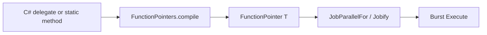

# Jobify & jobs

Burst-compiled function pointers wired into Unity Jobs. Code: `package/Runtime/Jobify/`.

## Flow



## Function pointers

```cs
using static Unity.Mathematics.FunctionPointers;
using static Unity.Mathematics.FunctionPointers.Signature;

var ptr = compilePtr((f1_f1)(x => x.abs()));
float y = ptr.Invoke(3f);
```

## Parallel map

```cs
using Unity.Collections;
using Unity.Jobs;
using static Unity.Mathematics.JobifyExtensions;

NativeArray<float> input = ...;
NativeArray<float> output = ...;

JobHandle handle = input.Map(output, ptr, batchSize: 64);
handle.Complete();
```

## Noise fill job

```cs
output.FillNoise2D(size, origin, spacing);
```

## Iteration helpers

`mathx.iteration.cs` provides `apply`, `applyfp`, and `forEach2DBurst` — see [API](../api/api/metadata/Unity.Mathematics.mathx.html).

## API types

- [Jobify](../api/api/metadata/Unity.Mathematics.Jobify.html)
- [JobParallelFor](../api/api/metadata/Unity.Mathematics.JobParallelFor.html)
- [FunctionPointers](../api/api/metadata/Unity.Mathematics.FunctionPointers.html)
